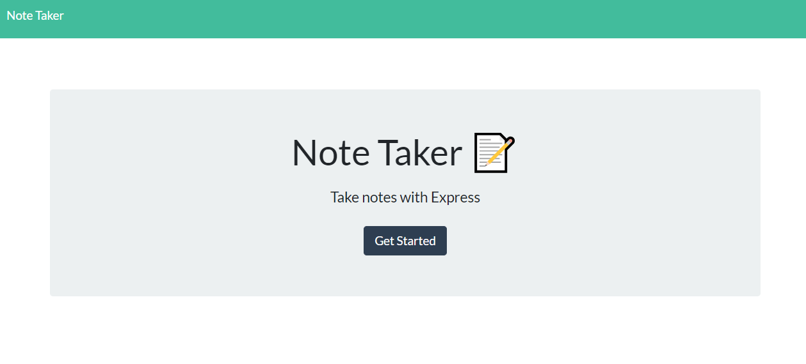
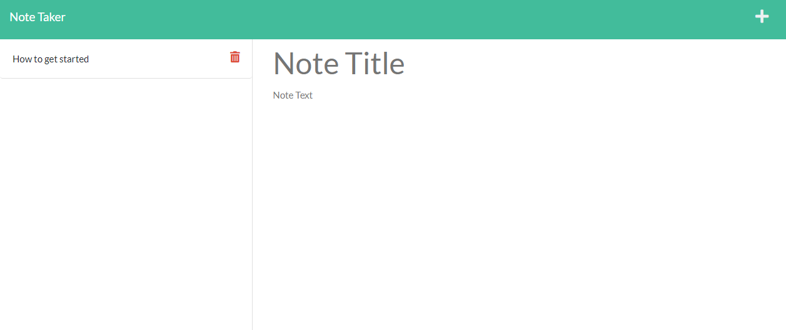

# Note Taker 

## Description

This project was all about setting up a server while using express, routes and middleware. I was also able to practice and use Heroku to host my application for easier access to try my application. 

The application itself is a way for a user to write down notes for themselves which persists using a database that stores the data. They are easily able to save the note as well as view and delete the note. 

## Installation

You can start you're own server by installing the npm dependencies with 'npm i' in you're terminal then running the server file with node using 'node server.js'. To reach server just navigate to http://localhost:3001/. You can also visit a demo of the app that is hosted on Heroku located at https://note-taker-3010.herokuapp.com/. 

## Usage

After visiting the homepage click on the 'Get Started' button to navigate to the applications page. Previous notes saved will be loaded on the left from the database in [db folder](./db/db.json). You'll be presented with a 'Note Title' and 'Note Text' fields where you can type in and once both are filled a save icon will appear on the top right to save the note. The note will then be loaded on the left side along with other previous notes which you can double click to load and view. You can click on the red trashcan next to the note to delete that particular note or click on the plus sign on the top right to clear the fields to be able to create a new note. Below are image examples of the application. 

## License

N/A